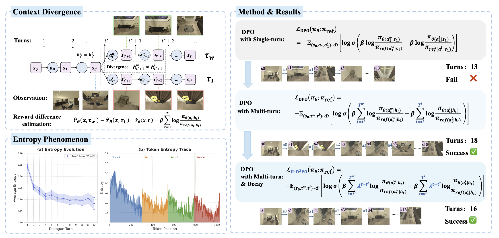
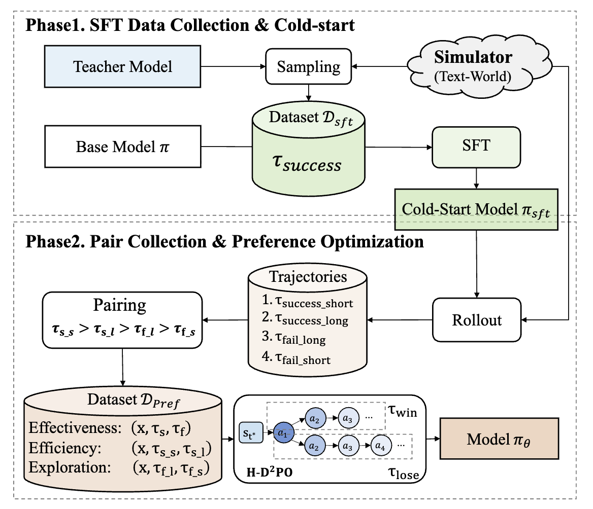
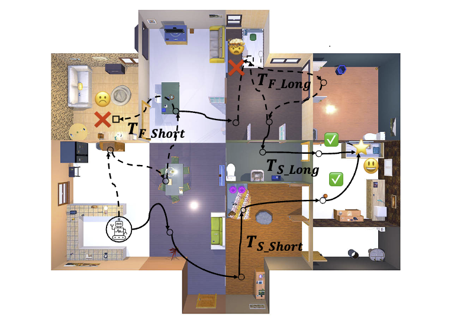
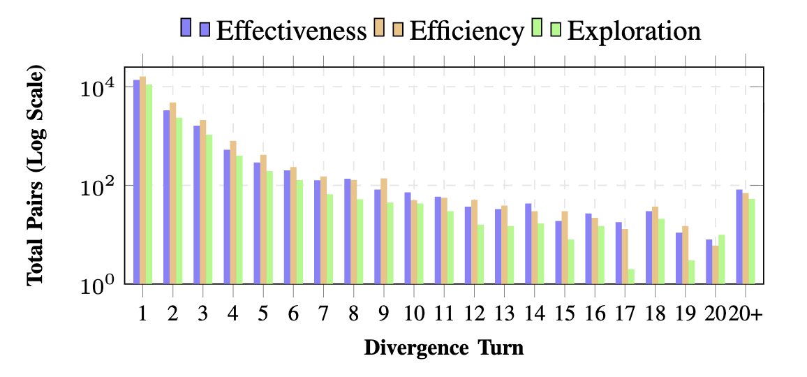
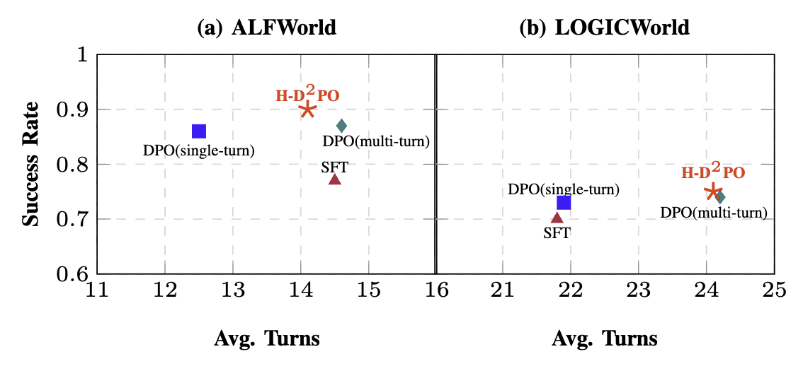

# Mitigating Context Divergence in Multi-Turn Embodied Reasoning via Hierarchical Decay

**H-D²PO (Hierarchical Temporal Decay DPO)** is an alignment framework designed specifically for multi-turn embodied reasoning. It addresses a critical challenge when applying DPO to embodied agents: **Context Divergence** — once the chosen and rejected trajectories diverge at a branching step, all subsequent observations and histories drift apart, making naive trajectory-level preference comparison mathematically ill-posed.

## News

- 🚧 Code and data will be released soon.

## Highlights

- **Context Divergence analysis.** We identify the context divergence dilemma in embodied DPO: extending preference optimization to multi-turn trajectories enables long-term credit assignment, but inevitably introduces gradient noise from drifting observation histories. We also observe *local entropy spikes* at the onset of each interaction turn, corroborating that injected environmental observations are a source of optimization noise.
- **Hierarchical Temporal Decay.** The H-D²PO objective re-weights each step's implicit reward by a decay factor $\gamma(t)=\lambda^{t-t^\*}$ relative to the branching point $t^\*$, prioritizing the causal branching decision while suppressing noise from the divergent trajectory tail.
- **Priority-based Preference Construction.** A data strategy that pairs trajectories under a strict capability hierarchy — Effectiveness ($S \succ F$), Efficiency ($S_S \succ S_L$), and Exploration ($F_L \succ F_S$) — teaching the agent that long failures (deep reasoning before an error) are better than short ones (hallucination / early quit).
- **State-of-the-art results.** On ALFWorld, our Qwen3-4B agent achieves **89.78%** success rate, surpassing SFT (77.01%), Single-Turn DPO (86.13%), and Multi-Turn DPO (87.23%). Gains are consistent at the 0.6B scale and on LOGICWorld.

## Overview

<p align="center">
  
</p>

**Left:** Context Divergence caused by inserted observations in multi-turn embodied reasoning. While average sentence-level entropy decreases across turns, **local entropy spikes** occur at the onset of each interaction turn — corresponding to the injection of environmental observations. **Right:** Single-Turn DPO fails to handle long horizons, while Multi-Turn DPO suffers from noise interference. By employing turn-wise weight decay, H-D²PO suppresses divergence noise and achieves the best performance.

## Method

### Hierarchical Temporal Decay Objective

For a preference pair $(\tau_w, \tau_l)$ diverging at turn $t^\*$, the implicit reward of vanilla DPO accumulates log-ratios over the entire trajectory, but steps after $t^\*$ are conditioned on disparate states — introducing high variance. H-D²PO instead optimizes a **Temporally Decayed Implicit Reward**:

$$
R_\gamma(\tau) = \beta \sum_{t=0}^{T} \gamma(t) \log \frac{\pi_\theta(a_t \mid h_t)}{\pi_{ref}(a_t \mid h_t)},
\qquad
\gamma(t) = \mathbb{I}(t \ge t^*) \cdot \lambda^{t - t^\*}
$$

where identical prefixes contribute zero information and divergent steps decay exponentially from weight 1. Substituting into the Bradley-Terry model yields the H-D²PO loss:

$$
\mathcal{L}_{\text{H-D}^2\text{PO}} = -\,\mathbb{E}_{(x,\tau_w,\tau_l)\sim\mathcal{D}}
\left[\log \sigma \left( R_\gamma(\tau_w) - R_\gamma(\tau_l) \right) \right]
$$

Intuitively, this optimizes a discounted value function relative to the decision bifurcation: focus on the causal root of the outcome, and robustly filter long-horizon drift.

### Training Pipeline

<p align="center">
  
</p>

The framework proceeds in two phases:

1. **Cold-Start SFT via Distillation.** A powerful teacher model (DeepSeek-V3.2-Exp) interacts with the environment to generate expert trajectories; successful ones (~23k) are used to SFT the base model, producing $\pi_{sft}$, which serves as both the reference policy and the exploration starting point.
2. **Priority-based Preference Learning.** We prompt $\pi_{sft}$ with temperature sampling ($T=1.5$) to generate 5 diverse rollouts per instruction, categorized into four buckets by outcome and horizon length:

<p align="center">
  
  
</p>

Preference pairs are then constructed under a strict hierarchy:

| Priority | Pair | Purpose |
|---|---|---|
| Effectiveness | $S \succ F$ | Anchor goal completion |
| Efficiency | $T_{S\_S} \succ T_{S\_L}$ | Discourage redundant actions (navigation loops, indecisive planning) |
| Exploration | $T_{F\_L} \succ T_{F\_S}$ | Encourage reasoning stability; prevent "early-quit" policy collapse in sparse-reward settings |

After downsampling the heavily skewed turn-1 divergences, the final preference dataset comprises ~**60k pairs**.

## Main Results

Success Rate (%) on ALFWorld (274 tasks) and LOGICWorld (1,082 tasks):

| Model | Pick | Look | Clean | Heat | Cool | Pick2 | **ALFWorld All** | Multi-goal | Condition | Priority | Logic | **LOGICWorld All** |
|---|---|---|---|---|---|---|---|---|---|---|---|---|
| Qwen3-0.6B | 6.45 | 0.00 | 0.00 | 0.00 | 0.00 | 0.00 | 0.73 | 0.00 | 0.00 | 6.00 | 6.39 | 4.81 |
| Qwen3-0.6B-SFT | 88.14 | 51.61 | 74.14 | 84.62 | 67.39 | 34.15 | 68.98 | 24.00 | 61.67 | 12.67 | 44.17 | 42.79 |
| Qwen3-0.6B-SFT + DPO (single-turn) | 91.53 | 48.39 | 89.66 | 82.05 | 67.39 | 70.73 | 77.74 | 32.00 | 65.33 | 24.67 | 60.15 | 54.07 |
| Qwen3-0.6B-SFT + DPO (multi-turn) | **98.31** | 54.84 | **93.10** | 76.92 | 86.96 | 58.54 | 81.39 | 34.00 | **67.67** | 24.67 | 60.53 | 55.08 |
| **Qwen3-0.6B-SFT + H-D²PO** | 96.61 | **58.06** | **93.10** | **84.62** | **89.13** | **70.73** | **84.67** | **38.00** | **67.67** | **33.33** | **63.91** | **58.32** |
| Qwen3-4B | 83.05 | 16.13 | 58.62 | 26.09 | 23.08 | 39.02 | 45.62 | 17.00 | 32.00 | 6.67 | 15.23 | 18.85 |
| Qwen3-4B-SFT | 94.92 | 51.61 | 87.93 | 71.79 | 67.39 | 70.73 | 77.01 | 44.00 | 76.33 | 48.00 | 76.50 | 69.50 |
| Qwen3-4B-SFT + DPO (single-turn) | 96.61 | 74.19 | 91.38 | **82.05** | 80.43 | 82.93 | 86.13 | **52.00** | 82.33 | 58.00 | 76.32 | 73.20 |
| Qwen3-4B-SFT + DPO (multi-turn) | 98.31 | 77.42 | 89.66 | **82.05** | 78.26 | **90.24** | 87.23 | 47.00 | 81.33 | **61.33** | **78.57** | 74.03 |
| **Qwen3-4B-SFT + H-D²PO** | **100** | **80.65** | **93.10** | 79.49 | **86.96** | **90.24** | **89.78** | 51.00 | **84.67** | **61.33** | 77.82 | **74.95** |

### Efficiency Analysis

<p align="center">
  
</p>

Single-Turn DPO achieves reasonable success with the fewest turns but lacks robustness on long-horizon tasks. Multi-Turn DPO and H-D²PO both engage in longer reasoning chains, but at similar path lengths H-D²PO consistently achieves higher success rates — temporal decay ensures the agent's persistence translates into task success rather than futile long-horizon wandering.

### Ablation: Data Strategy (Qwen3-0.6B)

| Configuration | ALFWorld SR | ALFWorld Turns | LOGICWorld SR | LOGICWorld Turns |
|---|---|---|---|---|
| **H-D²PO (All)** | **84.67** | 12.39 | **58.32** | 52.65 |
| w/o Exploration ($F_L \succ F_S$) | 79.93 | **11.89** | 57.39 | **38.48** |
| w/o Efficiency ($S_S \succ S_L$) | 80.29 | 14.92 | 55.40 | 63.10 |

Removing exploration pairs causes the largest drop, accompanied by fewer average turns — without learning that "long failures beat short failures," the policy gives up early. Removing efficiency pairs inflates turn counts with redundant actions.

## Implementation Details

- **Backbone:** Qwen3-0.6B and Qwen3-4B (LoRA rank 8, alpha 16)
- **Optimizer:** AdamW with cosine LR schedule; 3 epochs; global batch size 16
- **SFT:** LR 1e-4, max context 16k tokens
- **DPO:** LR 5e-6, max context 12k tokens, KL coefficient $\beta = 0.1$
- **H-D²PO:** temporal decay factor $\lambda = 0.9$
- **Hardware:** 2× NVIDIA A100 (80GB), DeepSpeed ZeRO-3

## Citation

```bibtex
@inproceedings{liu2026hd2po,
  title     = {Mitigating Context Divergence in Multi-Turn Embodied Reasoning via Hierarchical Decay},
  author    = {Liu, Gangao and Wang, Mengna and Li, Peng},
  booktitle = {IJCNN},
  year      = {2026}
}
```
